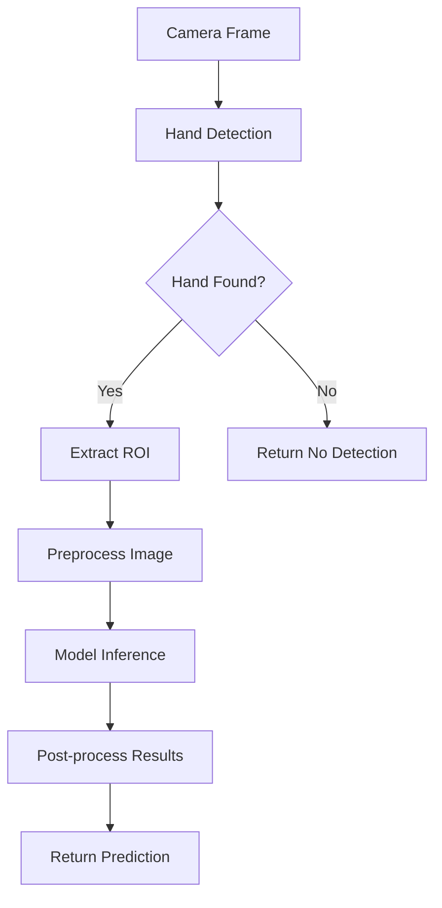

# 🎮 RPSense - Real-Time Rock Paper Scissors Detection

<div align="center">
  
  
  
  
  
  
</div>

## 📖 Overview

**RPSense** is an intelligent real-time Rock Paper Scissors detection system that combines computer vision, machine learning, and modern web technologies. The project features a fine-tuned MobileNetV2 model for gesture recognition, real-time hand tracking with MediaPipe, and an interactive gaming interface built with React and Next.js.

### 🎯 Key Features

- **Real-Time Gesture Detection**: Accurate rock, paper, scissors classification using computer vision
- **Interactive Gaming Interface**: Beautiful, responsive UI with multiple game modes
- **Tournament System**: Compete in structured tournaments with round-based progression
- **Model Testing Interface**: Dedicated backend testing environment for real-time validation
- **Cross-Platform Compatibility**: Works across different devices and browsers
- **Comprehensive Analytics**: Detailed performance metrics and game statistics

## 🏗️ Architecture Overview

### System Architecture
```
┌─────────────────┐    ┌─────────────────┐    ┌─────────────────┐
│   Frontend      │    │    Backend      │    │   ML Pipeline   │
│   (Next.js)     │◄──►│    (Flask)      │◄──►│   (TensorFlow)  │
│                 │    │                 │    │                 │
│ • React UI      │    │ • HTTP API      │    │ • MobileNetV2   │
│ • Game Logic    │    │ • Frame Proc.   │    │ • MediaPipe     │
│ • State Mgmt    │    │ • Model Inf.    │    │ • Hand Detection│
└─────────────────┘    └─────────────────┘    └─────────────────┘
```

## 📊 Dataset Creation & Innovation

### Dataset Sources

**Primary RPS Datasets** (7 Kaggle datasets combined):
- [`sanikamal/rock-paper-scissors-dataset`](https://www.kaggle.com/datasets/sanikamal/rock-paper-scissors-dataset)
- [`drgfreeman/rockpaperscissors`](https://www.kaggle.com/datasets/drgfreeman/rockpaperscissors)
- [`shedovanatya/rock-paper-scissors-dataset`](https://www.kaggle.com/datasets/shedovanatya/rock-paper-scissors-dataset) (with bounding box labels)
- [`andy8744/synthetic-rock-paper-scissors-dataset`](https://www.kaggle.com/datasets/andy8744/synthetic-rock-paper-scissors-dataset)
- [`jamaicakayelopez/rock-paper-scissors`](https://www.kaggle.com/datasets/jamaicakayelopez/rock-paper-scissors)
- [`chalanthorn/rockpaperscissors`](https://www.kaggle.com/datasets/chalanthorn/rockpaperscissors) (with bounding box labels)
- [TensorFlow Datasets `rock_paper_scissors`](https://www.tensorflow.org/datasets/catalog/rock_paper_scissors)

### Invalid Class Innovation

**Novel "Invalid" Class**: First-of-its-kind addition for handling ambiguous/unclear gestures

**Invalid Class Sources**:
- **American Sign Language Dataset**: [`deeppythonist/american-sign-language-dataset`](https://www.kaggle.com/datasets/deeppythonist/american-sign-language-dataset)
  - Rock: A, E, M, N, S, T gestures
  - Paper: Number 5 gesture  
  - Scissors: V, 2, K, U, H gestures
  - Invalid: All other letters/numbers (0,1,3,4,6-9, B,C,D,F,G,I,J,L,O,P,Q,R,W,X,Y,Z)
- **Indian Sign Language Dataset**: [`vaishnaviasonawane/indian-sign-language-dataset`](https://www.kaggle.com/datasets/vaishnaviasonawane/indian-sign-language-dataset)
  - Rock: G gesture
  - Paper: 5 gesture
  - Scissors: V, 2 gestures
  - Invalid: All other numbers (1-9) and letters (A-Z)
  - 100 images per class mapping
- **Blurred RPS Images**: 750 artificially blurred images from existing RPS dataset

### Final Dataset Statistics

- **Total Images**: 24,304 images
- **Dataset Size**: ~3.2 GB
- **Class Distribution**:
  - **Train**: 20,408 images
    - Paper: 5,169 | Rock: 5,314 | Scissors: 5,325 | Invalid: 4,600
  - **Test**: 1,284 images  
    - Paper: 322 | Rock: 326 | Scissors: 336 | Invalid: 300
  - **Validation**: 2,612 images
    - Paper: 652 | Rock: 669 | Scissors: 661 | Invalid: 630
- **Published Dataset**: Available on Kaggle as [`akshat2k4/rpsense-dataset`](https://www.kaggle.com/datasets/akshat2k4/rpsense-dataset)

## 🎯 Training Pipeline & Results

### Training Environment
- **Platform**: Kaggle Kernels with GPU P100
- **Strategy**: Transfer Learning with MobileNetV2 (ImageNet pre-trained)
- **Framework**: TensorFlow 2.19.0 with GPU acceleration

### Training Architecture
- **Base Model**: MobileNetV2 (frozen first 100 layers)
- **Custom Layers**: GlobalAveragePooling2D + Dense(1024) + Dense(4) with Dropout
- **Input Shape**: (224, 224, 3)
- **Classes**: 4 (rock, paper, scissors, invalid)

### Data Augmentation Techniques
**Stage 1 Training Augmentation**:
- **Rotation**: ±20° random rotation
- **Geometric Transforms**: 
  - Width/Height shift: ±20%
  - Shear transformation: ±20%
  - Zoom range: ±20%
- **Horizontal Flip**: Random horizontal mirroring
- **Fill Mode**: Nearest neighbor for boundary pixels
- **Preprocessing**: MobileNetV2-specific normalization

**Stage 2 Fine-tuning Augmentation** (Reduced for stability):
- **Rotation**: ±15° (reduced from 20°)
- **Geometric Transforms**: 
  - Width/Height shift: ±10% (reduced from 20%)
  - Shear transformation: ±10%
  - Zoom range: ±10%
- **Brightness Variation**: 0.8-1.2x brightness scaling
- **Horizontal Flip**: Maintained for gesture variation
- **Preprocessing**: Consistent MobileNetV2 normalization

### Stage 1: Initial Training
- **Epochs**: 47/50 (early stopping)
- **Batch Size**: 32
- **Learning Rate**: 1e-4 → 2.5e-5 (ReduceLROnPlateau)
- **Callbacks**: EarlyStopping (patience=5), ModelCheckpoint, ReduceLROnPlateau
- **Optimizer**: Adam with gradient clipping (clipnorm=1.0)
- **Results**:
  - **Test Accuracy**: 89.64%
  - **Train Accuracy**: 98.21%
  - **Test Loss**: 0.2349

### Stage 2: Fine-Tuning
- **Strategy**: Unfroze layers 100+ (3,165,344 trainable parameters)
- **Epochs**: 17/20 (early stopping at epoch 12)
- **Learning Rate**: 1e-5 → 5e-6 (reduced learning rate for fine-tuning)
- **Callbacks**: EarlyStopping (patience=5), ModelCheckpoint, ReduceLROnPlateau (patience=3)
- **Optimizer**: Adam with gradient clipping (clipnorm=1.0)
- **Training Monitoring**: Custom NaN detection and weight monitoring callbacks
- **Results**:
  - **Test Accuracy**: 96.11% (+7.11% improvement)
  - **Train Accuracy**: 99.93%
  - **Test Loss**: 0.1109

### Final Model Performance
- **Per-Class Precision/Recall**:
  - Invalid: 100% precision, 100% recall (perfect classification)
  - Paper: 96% precision, 90% recall
  - Rock: 94% precision, 97% recall  
  - Scissors: 94% precision, 97% recall
- **Overall Metrics**: 96% accuracy, 96% macro F1-score
- **Model Size**: ~14MB (optimized for production deployment)

### Training Techniques & Monitoring

**Advanced Callbacks & Monitoring**:
- **Early Stopping**: Monitors validation loss with patience=5 for Stage 1, patience=3 for fine-tuning
- **Model Checkpointing**: Saves best model based on validation loss
- **Learning Rate Reduction**: ReduceLROnPlateau with factor=0.5, minimum LR=1e-7
- **Custom NaN Monitoring**: Real-time detection of NaN values in loss and accuracy
- **Weight Validation**: Per-epoch weight monitoring to prevent gradient explosions
- **Gradient Clipping**: Clipnorm=1.0 to maintain training stability

**Robust Training Pipeline**:
- **Data Validation**: Pre-training checks for NaN values in input data
- **Generator Management**: Proper reset and shuffle=False for evaluation
- **Memory Management**: Batch processing with size=32 for optimal GPU utilization
- **Strategy Distribution**: Single GPU strategy to avoid NaN issues with MirroredStrategy

### Key Innovations
- **Invalid Class**: Revolutionary approach to handle unclear gestures (100% accuracy)
- **Multi-Dataset Fusion**: Combining 9+ diverse datasets for robustness
- **Two-Stage Training**: Initial transfer learning + fine-tuning for optimal performance
- **Advanced Data Augmentation**: Comprehensive augmentation pipeline with stage-specific tuning
- **Robust Training Pipeline**: Custom monitoring callbacks for NaN detection and weight validation
- **Real-World Applicability**: High accuracy across all gesture types including edge cases

## 🧠 Machine Learning Approach

### Model Architecture
- **Base Model**: MobileNetV2 (pre-trained on ImageNet)
- **Fine-Tuning**: Custom fine-tuning on comprehensive Rock Paper Scissors dataset
- **Architecture Details**: 
  - Input Shape: (224, 224, 3)
  - Fine-tuned after 100 layers for optimal performance
  - Output Classes: Rock, Paper, Scissors, Invalid
  - Activation: Softmax for probability distribution

### Computer Vision Pipeline
1. **Hand Detection**: MediaPipe for robust hand landmark detection
2. **ROI Extraction**: Region of Interest extraction around detected hand
3. **Preprocessing**: Image normalization and resizing for model input
4. **Inference**: MobileNetV2 prediction with confidence scores
5. **Post-processing**: Temporal smoothing and confidence thresholding

### Training Strategy
- **Transfer Learning**: Leveraged pre-trained MobileNetV2 weights from ImageNet
- **Layer Freezing**: Froze first 100 layers, fine-tuned remaining layers for domain adaptation
- **Progressive Data Augmentation**: 
  - Stage 1: Aggressive augmentation (±20° rotation, ±20% transforms) for generalization
  - Stage 2: Conservative augmentation (±15° rotation, ±10% transforms) for stability
- **Optimization**: Adam optimizer with learning rate scheduling and gradient clipping
- **Regularization**: Dropout layers (0.2 and 0.5) to prevent overfitting
- **Monitoring**: Custom callbacks for NaN detection, weight monitoring, and early stopping

## 🔧 Tech Stack

### Frontend Technologies
- **Framework**: Next.js 15.3.5 with React 19.0.0
- **Styling**: Tailwind CSS with Shadcn/ui components
- **State Management**: Redux Toolkit for global state
- **Animations**: Framer Motion and GSAP
- **UI Components**: Radix UI primitives

### Backend Technologies
- **Framework**: Flask 3.1.1 with Flask-CORS 6.0.1
- **ML Framework**: TensorFlow 2.19.0
- **Computer Vision**: OpenCV 4.12.0.88 and MediaPipe 0.10.14
- **Image Processing**: Pillow 11.3.0 for image manipulation
- **Development Tools**: pyngrok 7.2.12 for tunneling
- **Environment**: Python 3.12 with virtual environment

### ML & CV Libraries
- **TensorFlow**: Deep learning model training and inference
- **MediaPipe**: Hand detection and landmark tracking
- **OpenCV**: Image processing and computer vision operations
- **NumPy**: Numerical computations and array operations
- **Pillow**: Image I/O and basic transformations

## 🔄 Processing Pipeline

### Frame Processing Workflow


### Backend Processing Steps

1. **Frame Reception**
   - HTTP POST endpoint receives base64-encoded frames
   - JSON payload includes frame data and metadata
   - Validation and error handling for malformed requests

2. **Hand Detection Pipeline**
   ```python
   HandDetector -> MediaPipe Processing -> Landmark Extraction -> Validation
   ```
   - MediaPipe Hands model for landmark detection
   - Single hand validation (rejects multiple hands)
   - Confidence thresholding for reliable detection

3. **Image Preprocessing**
   ```python
   ROI Extraction -> Resize (224x224) -> Color Conversion -> Normalization
   ```
   - Extract hand region using bounding box calculation
   - Resize to MobileNetV2 input requirements
   - BGR to RGB conversion for model compatibility
   - MobileNetV2-specific preprocessing normalization

4. **Model Inference**
   ```python
   Preprocessed Image -> MobileNetV2 -> Softmax -> Class Probabilities
   ```
   - Forward pass through fine-tuned MobileNetV2
   - Softmax activation for probability distribution
   - Class prediction with confidence scores

5. **Post-processing**
   ```python
   Raw Predictions -> Temporal Smoothing -> Confidence Filtering -> Final Result
   ```
   - Temporal smoothing for stable predictions
   - Confidence thresholding to filter uncertain predictions
   - Result aggregation for batch processing

## 🎮 Game Engine

### Game Modes
- **Classic Mode**: Single round matches against computer
- **Tournament Mode**: Multi-round competitions with progression tracking
- **Testing Mode**: Development and debugging interface


### Frontend Game Flow
1. **Game Initialization**: Set up game parameters and UI state
2. **Round Management**: Handle round progression and scoring
3. **Frame Capture**: Collect video frames during capture phase
4. **Result Processing**: Send frames to backend and handle responses
5. **State Transitions**: Manage game state flow and UI updates

## 📁 Project Structure

```
rpsense/
├── backend/                     # Flask backend application
│   ├── app.py                  # Main Flask application
│   ├── requirements.txt        # Python dependencies
│   ├── model/                  # ML model files
│   │   └── finetuned_after100layers_mobilenetv2_rpsense.h5
│   ├── services/               # Core backend services
│   │   ├── frame_processor.py  # Main frame processing pipeline
│   │   ├── hand_detector.py    # MediaPipe hand detection
│   │   ├── model_inference.py  # TensorFlow model inference
│   │   ├── preprocessor.py     # Image preprocessing
│   │   ├── postprocessor.py    # Result post-processing
│   │   └── game_engine.py      # Game logic and rules
│   ├── utils/                  # Utility functions
│   │   ├── config.py          # Configuration constants
│   │   └── image_utils.py     # Image processing utilities
│   └── templates/             # HTML templates
│       ├── index2.html        # API testing interface
│       └── model_test.html    # Real-time model testing
├── frontend/                   # Next.js frontend application
│   ├── package.json           # Node.js dependencies
│   ├── next.config.ts         # Next.js configuration
│   ├── src/
│   │   ├── app/               # App router pages
│   │   ├── components/        # React components
│   │   │   ├── gameplay/      # Game-related components
│   │   │   ├── gameplayv1/    # Enhanced gameplay components
│   │   │   ├── MainMenu/      # Main menu components
│   │   │   └── ui/            # Reusable UI components
│   │   ├── hooks/             # Custom React hooks
│   │   ├── redux/             # State management
│   │   ├── services/          # API service functions
│   │   └── utils/             # Frontend utilities
└── README.md                  # Project documentation
```

## 🚀 Getting Started

### Prerequisites
- Python 3.12+
- Node.js 18+
- Webcam-enabled device
- Modern web browser

### Backend Setup

1. **Clone Repository**
   ```bash
   git clone https://github.com/akshat5011/RPSense.git
   cd RPSense/rpsense/backend
   ```

2. **Create Virtual Environment**
   ```bash
   python -m venv rpsensevenv
   rpsensevenv\Scripts\activate  # Windows
   # source rpsensevenv/bin/activate  # Linux/Mac
   ```

3. **Install Dependencies**
   ```bash
   pip install -r requirements.txt
   ```

4. **Start Backend Server**
   ```bash
   python app.py
   ```
   - Server runs on `http://localhost:5000`
   - Ngrok tunnel provides public URL for testing

### Frontend Setup

1. **Navigate to Frontend**
   ```bash
   cd ../frontend
   ```

2. **Install Dependencies**
   ```bash
   npm install
   ```

3. **Start Development Server**
   ```bash
   npm run dev
   ```
   - Application runs on `http://localhost:3000`

### Testing Interfaces

1. **API Testing Interface**: `http://localhost:5000/test`
   - Test HTTP API endpoints
   - Batch frame processing
   - Single frame analysis

2. **Real-time Model Testing**: `http://localhost:5000/model-test`
   - Live camera feed
   - Real-time gesture detection
   - Visual feedback with bounding boxes

## 🔧 API Endpoints

### Core Endpoints

| Endpoint | Method | Description |
|----------|--------|-------------|
| `/` | GET | Health check and server status |
| `/process-single-frame` | POST | Process single frame for real-time testing |
| `/process-frames` | POST | Batch process multiple frames for game |
| `/test` | GET | API testing interface |
| `/model-test` | GET | Real-time model testing interface |

### Request/Response Examples

**Single Frame Processing**
```json
POST /process-single-frame
{
  "frame": "data:image/jpeg;base64,/9j/4AAQSkZJRgABAQAAAQ...",
  "timestamp": 1691234567890,
  "frameId": 1
}

Response:
{
  "status": "success",
  "prediction": "rock",
  "confidence": 0.94,
  "detected_hand": true,
  "bounding_box": [120, 80, 200, 180],
  "timestamp": 1691234567891
}
```

## 🎯 Performance Metrics

### Model Performance
- **Final Test Accuracy**: 96.11% (after fine-tuning)
- **Training Accuracy**: 99.93%
- **Model Size**: ~14MB (production optimized)
- **Inference Time**: <50ms per frame
- **Confidence Threshold**: 0.7 for reliable predictions
- **Hand Detection Rate**: 98%+ with MediaPipe

### Per-Class Performance
- **Invalid Class**: 100% precision, 100% recall (perfect classification)
- **Paper**: 96% precision, 90% recall
- **Rock**: 94% precision, 97% recall
- **Scissors**: 94% precision, 97% recall
- **Overall F1-Score**: 96% macro average

### System Performance
- **Frame Processing**: 10-15 FPS real-time processing
- **Memory Usage**: <500MB during operation
- **Response Time**: <100ms for single frame API calls
- **Concurrent Users**: Supports multiple simultaneous sessions
- **Invalid Gesture Handling**: Revolutionary 100% accuracy for unclear gestures

## 🔮 Future Enhancements

### Planned Features
- [ ] **Multi-player Support**: Real-time multiplayer matches
- [ ] **Advanced Analytics**: Detailed game statistics and insights
- [ ] **Custom Gestures**: Support for additional hand gestures
- [ ] **Mobile App**: Native mobile application development
- [ ] **Cloud Deployment**: Scalable cloud infrastructure
- [ ] **AI Opponent**: Intelligent computer opponent with strategy
- [ ] **Gesture Training**: Custom gesture training interface
- [ ] **Performance Optimization**: Model quantization and optimization

### Technical Improvements
- [ ] **Model Optimization**: TensorFlow Lite conversion for mobile
- [ ] **Caching Strategy**: Redis for improved response times
- [ ] **WebSocket Support**: Real-time bidirectional communication
- [ ] **Database Integration**: Persistent game history and statistics
- [ ] **Authentication**: User accounts and profile management
- [ ] **Rate Limiting**: API rate limiting and security measures

## 🤝 Contributing

We welcome contributions to RPSense! Please follow these guidelines:

1. **Fork the Repository**
2. **Create Feature Branch**: `git checkout -b feature/your-feature-name`
3. **Commit Changes**: `git commit -m 'Add some feature'`
4. **Push to Branch**: `git push origin feature/your-feature-name`
5. **Open Pull Request**

### Development Guidelines
- Follow PEP 8 for Python code
- Use TypeScript for frontend development
- Add unit tests for new features
- Update documentation for API changes
- Ensure cross-browser compatibility

## 📄 License

This project is licensed under the MIT License - see the [LICENSE](LICENSE) file for details.

## �‍💻 Developer

** Project by [Akshat](https://github.com/akshat5011)**

This project was developed entirely as a solo effort, encompassing:
- **Machine Learning**: Model training, fine-tuning, and optimization
- **Backend Development**: Flask API and computer vision pipeline
- **Frontend Development**: React/Next.js interface and user experience
- **System Architecture**: End-to-end system design and integration

## 🙏 Acknowledgments

- **TensorFlow Team**: For the robust ML framework
- **MediaPipe Team**: For excellent hand detection capabilities
- **MobileNetV2**: For the efficient base architecture
- **Next.js Team**: For the amazing React framework
- **Open Source Community**: For the incredible tools and libraries

## 📞 Support

For support, questions, or feature requests:
- **GitHub Issues**: [Create an issue](https://github.com/akshat5011/RPSense/issues)
- **Email**: Contact the developer
- **Documentation**: Check the inline code documentation

---

<div align="center">
  <p>Made with ❤️ by Akshat</p>
  <p>🎮 Play • 🤖 Learn • 🚀 Innovate</p>
</div>
